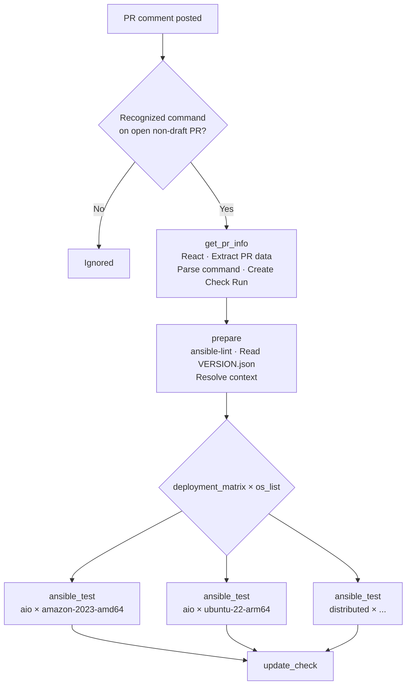
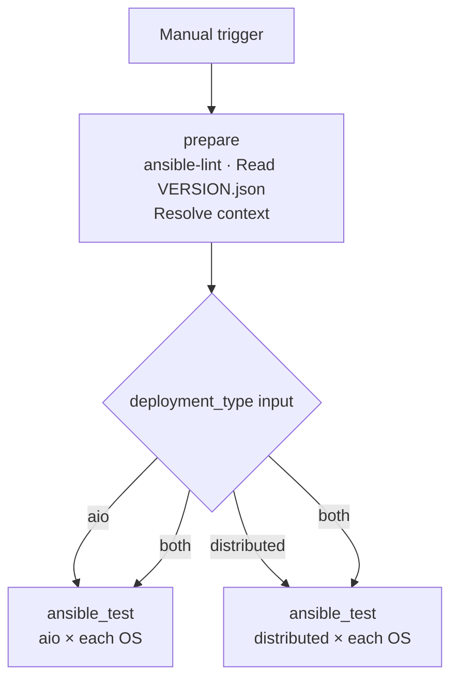

# Ansible Integration Tests

Workflow file: `.github/workflows/5_check_integration_tools.yaml`

This workflow runs `ansible-lint` against the PR branch, then provisions EC2 instances, deploys Wazuh using the Ansible playbooks, and runs the integration test suite against the live deployment. The test matrix combines deployment type and target OS, so each combination runs independently.

---

## Triggers

| Mode | Trigger | Who can trigger |
|---|---|---|
| PR comment | `issue_comment` on an open, non-draft PR | OWNER, MEMBER, or COLLABORATOR |
| Manual | `workflow_dispatch` | Anyone with repo write access |

---

## Execution Flows

### issue_comment flow



**Recognized commands:**

| Comment | Deployment matrix |
|---|---|
| `/test-ansible` | `["aio","distributed"]` |
| `/test-ansible-aio` | `["aio"]` |
| `/test-ansible-distributed` | `["distributed"]` |

Draft PRs are explicitly rejected — if the PR is in draft state, `get_pr_info` exits with an error even if the command is recognized.

When triggered by PR comment, `os_list`, `environment`, and `commit_list` default to fixed values (see [Job 2 — prepare](#job-2----prepare-both-triggers)).

### workflow_dispatch flow



---

## Parameters

### workflow_dispatch inputs

| Input | Required | Default | Description |
|---|---|---|---|
| `pr_head_ref` | Yes | — | Branch of `wazuh-ansible` to test |
| `automation_reference` | No | `5.0.0` | Branch of `wazuh-automation` to use |
| `deployment_type` | Yes | — | `aio`, `distributed`, or `both` |
| `os_list` | No | `["amazon-2023-amd64","ubuntu-26-arm64","ubuntu-24-amd64","redhat-10-arm64"]` | JSON array of target OS identifiers |
| `environment` | No | `development` | `development`, `prerelease`, or `production` — controls package URL source |
| `commit_list` | No | `["latest","latest","latest","latest","latest"]` | Per-component revisions: `[indexer, manager, dashboard, agent, installation-assistant]` |

### issue_comment parameters

| Parameter | Source |
|---|---|
| `pr_head_ref` | PR head branch from GitHub API |
| `deployment_matrix` | Parsed from comment command |
| `os_list` | Fixed: `["amazon-2023-amd64","ubuntu-22-arm64","redhat-9-amd64"]` |
| `environment` | Fixed: `development` |
| `commit_list` | Fixed: `["latest","latest","latest","latest","latest"]` |
| `automation_reference` | Defaults to `main` |

---

## Test Matrix

The `ansible_test` job runs once per `deployment_type × system` combination. Each combination provisions its own set of EC2 instances and runs independently.

**Example expansion with default `os_list` and `deployment_type=both`:**

| Matrix cell | Instances provisioned |
|---|---|
| `aio × amazon-2023-amd64` | 1 VM |
| `aio × ubuntu-22-arm64` | 1 VM |
| `aio × redhat-9-amd64` | 1 VM |
| `distributed × amazon-2023-amd64` | 6 VMs |
| `distributed × ubuntu-22-arm64` | 6 VMs |
| `distributed × redhat-9-amd64` | 6 VMs |

---

## Environment and Package Source

The `environment` input controls how Wazuh packages are sourced during the Ansible playbook run:

| Environment | Package source | `--extra-vars` passed to playbook |
|---|---|---|
| `development` | Presigned S3 URLs generated from `commit_list` revisions | `source=custom` |
| `prerelease` | Pre-release packages repository | `source=prerelease` |
| `production` | Official Wazuh packages repository | *(none)* |

---

## Job Details

### Job 1 — `get_pr_info` (issue_comment only)

| Step | What it does |
|---|---|
| React to comment | Adds a 🚀 reaction to the triggering PR comment |
| Extract PR data | Calls GitHub API to get `head_ref` and `head_sha`; exits with error if PR is in draft |
| Parse command | Maps comment text → `deployment_matrix` JSON and `check_name` string |
| Create Check Run | Creates a GitHub Check Run in `in_progress` state on the PR head SHA |

### Job 2 — `prepare` (both triggers)

| Step | What it does |
|---|---|
| Resolve context | Reads inputs (workflow_dispatch) or defaults (issue_comment) for `deployment_matrix`, `os_list`, `environment`, `commit_list` |
| Checkout `wazuh-ansible` | Full checkout of the target branch |
| `ansible-lint` | Runs `ansible/ansible-lint@v25` against `wazuh-aio.yml`, `wazuh-distributed.yml`, `wazuh-agent.yml`, and the two gather log playbooks |
| Read `VERSION.json` | Extracts `version` and `stage` |
| Show test plan | Logs the full test plan and writes a step summary including per-component revision table |

Outputs: `pr_head_ref`, `deployment_matrix`, `os_list`, `environment`, `commit_list`, `wazuh_version`, `wazuh_stage`, `issue_url`.

> `ansible-lint` runs in `prepare`, not in a separate job. If lint fails, the entire workflow stops before any infrastructure is provisioned.

### Job 3 — `ansible_test` (matrix: deployment_type × system)

Runs once per matrix combination. Each instance is fully independent.

#### Setup

1. Configure AWS credentials via OIDC (`AWS_IAM_ROLE`)
2. Checkout `wazuh-ansible` at `pr_head_ref`
3. Checkout `wazuh-automation` at `automation_reference`
4. Set up Python 3.12
5. Install dependencies: `yq`, `ansible-core==2.16`, `ansible-galaxy` collections from `requirements.yml`, allocator Python requirements

#### SSH key pair creation

A dedicated EC2 key pair is created per matrix combination:

```bash
aws ec2 create-key-pair --key-name gha_ansible_key_{run_id}_{deployment_type}_{system}
```

The private key is saved locally and used for all SSH connections in this matrix cell. It is deleted at the end of the job.

#### Instance allocation

**AIO — 1 instance:**

```bash
python3 wazuh-automation/deployability/modules/allocation/main.py \
  --action create \
  --provider aws \
  --size medium \
  --disk-size 32 \
  --composite-name {system} \
  --instance-name gha_ansible_{system}_aio_{run_id} \
  --label-termination-date 1d
```

Generates an Ansible INI inventory with a single host named `aio`.

**Distributed — 6 instances in parallel:**

The 6 instances (`wi1`, `wi2`, `wi3`, `dashboard`, `manager`, `worker`) are allocated concurrently using background processes (`&` + `wait`). Each uses the same key pair.

Instance naming: `gha_ansible_{system}_{node_name}_{run_id}`

The resulting INI inventory includes a `[wi_cluster]` group for the three indexer nodes and `[all:vars]` with `ansible_port=2200`.

**Distributed cluster topology:**

| Inventory host | Role | Indexer node name |
|---|---|---|
| `wi1` | Wazuh Indexer | `indexer` |
| `wi2` | Wazuh Indexer | `indexer-2` |
| `wi3` | Wazuh Indexer | `indexer-3` |
| `dashboard` | Wazuh Dashboard | — |
| `manager` | Wazuh Manager (master) | — |
| `worker` | Wazuh Manager (worker) | — |

#### Presigned URL generation (development environment only)

When `environment == development`, generates presigned S3 URLs for dev packages:

```bash
python wazuh-automation/tools/sign_urls/generate_presigned_dev_urls.py \
  --process test_ansible \
  --wazuh-version {wazuh_version} \
  --indexer-revision   {commit_list[0]} \
  --manager-revision   {commit_list[1]} \
  --dashboard-revision {commit_list[2]} \
  --assistant-revision {commit_list[4]} \
  --expires-in 43200
```

The generated `artifact_urls.yaml` is copied to `wazuh-ansible/roles/vars/artifact_urls.yaml` for the playbook to consume.

#### Wazuh deployment

Runs the appropriate playbook with `become` (`-b`):

```bash
# AIO
ansible-playbook wazuh-ansible/wazuh-aio.yml {EXTRA_VARS} -b \
  -i {ALLOCATOR_PATH}/inventory

# Distributed
ansible-playbook wazuh-ansible/wazuh-distributed.yml {EXTRA_VARS} -b \
  -i {ALLOCATOR_PATH}/inventory_all
```

After the playbook completes, the indexer's `network.host` is patched to `0.0.0.0` (test-only change so health checks can reach port 9200 from localhost) and `wazuh-indexer` is restarted via Ansible.

#### Wait for services

Polls via Ansible modules (up to 20 minutes total):

1. Indexer: polls `https://localhost:9200/_cluster/health` until HTTP 200 or 401 (up to 10 minutes, every 10s)
2. Manager (port 55000) and Dashboard (port 443): `ansible wait_for` in parallel, 5-minute timeout each

On failure, a diagnosis step runs `systemctl is-active`, `free -h`, `df -h`, and indexer journal on all hosts.

#### YAML inventory conversion

Before running tests, the INI inventory is converted to YAML format using `ansible-inventory --list | jq`:

- AIO: `inventory` → `inventory.yml`
- Distributed: `inventory_all` → `inventory_all.yml`

This YAML format is required by `test_runner`'s Ansible inventory reader.

#### Test execution

**AIO:**

```bash
test_runner \
  --test-type installer \
  --deployment-type ansible \
  --inventory {ALLOCATOR_PATH}/inventory.yml \
  --version {wazuh_version} \
  --log-level INFO \
  --output github \
  --output-file test-results-ansible-aio-{system}.github
```

**Distributed — runs four separate test_runner calls:**

| Call | `--host` | `--component-type` | Output file |
|---|---|---|---|
| Indexer wi1 | `wi1` | `indexer` | `test-results-ansible-distributed-indexer-wi1-{system}.github` |
| Indexer wi2 | `wi2` | `indexer` | `test-results-ansible-distributed-indexer-wi2-{system}.github` |
| Indexer wi3 | `wi3` | `indexer` | `test-results-ansible-distributed-indexer-wi3-{system}.github` |
| Manager | `manager` | `manager` | `test-results-ansible-distributed-manager-{system}.github` |
| Dashboard | `dashboard` | `dashboard` | `test-results-ansible-distributed-dashboard-{system}.github` |

All distributed calls use:
- `--test-type installer`
- `--deployment-type ansible`
- `--inventory {ALLOCATOR_PATH}/inventory_all.yml`

All four distributed steps use `continue-on-error: true`. A final step aggregates all outcomes and fails the job if any step reported `failure`.

For details on what the `installer` test type with `ansible` deployment validates, see the `Integration Test Module — Description` of the internal documentation.

#### Reporting

| Output | When | Content |
|---|---|---|
| Step summary | Always | All `test-results-ansible-*.github` files grouped by deployment/OS |
| PR comment | `issue_comment` trigger only | Posts or updates a comment per matrix cell (marker: `<!-- ansible-integration-check-{deployment}-{system} -->`) with ✅/❌ and per-component results |
| Artifact: `test-results-ansible-{deployment}-{system}-{run_id}` | Always | All results files for this cell, retained 7 days |
| Artifact: `wazuh-logs-{deployment}-{system}-{run_id}` | On failure only | Wazuh service logs collected via `gather_central_logs.yml` playbook, retained 7 days |

#### Cleanup (always runs, even on failure)

1. **AIO**: deallocate the single instance via allocator `--action delete`
2. **Distributed**: deallocate all 6 instances in parallel via allocator `--action delete`
3. **SSH key pair**: `aws ec2 delete-key-pair --key-name {KEY_NAME}` — always runs regardless of whether allocation succeeded

### Job 4 — `update_check` (issue_comment only)

Updates the GitHub Check Run created in Job 1:

| `ansible_test` result | Check conclusion |
|---|---|
| `success` | `success` — ✅ All Ansible integration tests passed |
| `failure` | `failure` — ❌ One or more tests failed |
| `cancelled` | `cancelled` |

---

## Required Secrets and Variables

### Secrets

| Secret | Used by |
|---|---|
| `AWS_IAM_ROLE` | OIDC role for AWS operations (allocator + EC2 key pairs) |
| `GH_CLONE_TOKEN` | Checkout `wazuh-automation` |
| `GITHUB_TOKEN` | PR comments and Check Run updates (built-in) |

### Repository variables

| Variable | Used by |
|---|---|
| `AWS_S3_BUCKET_DEV` | Dev package presigned URL generation |

---

## Permissions

| Permission | Purpose |
|---|---|
| `id-token: write` | OIDC authentication to AWS |
| `contents: read` | Checkout repository |
| `pull-requests: write` | Post PR comments |
| `issues: write` | Post comments via issues API |
| `checks: write` | Create and update GitHub Check Runs |

---

## Instance Naming

| Deployment | Node | Name pattern |
|---|---|---|
| AIO | Single VM | `gha_ansible_{system}_aio_{run_id}` |
| Distributed | Each of 6 VMs | `gha_ansible_{system}_{node_name}_{run_id}` |

EC2 instances are tagged with `termination-date: 1d` as a safety net. The SSH key pair is always deleted by the cleanup step regardless of test outcome.
